# Evidence

## Overview
Evidence for this project was collected from two primary sources:

1. **Indexed Linux log data analyzed in Splunk Enterprise**
2. **Password hash cracking output generated with John the Ripper**

The screenshots included in this repository document the searches, returned events, and credential recovery results used to support the investigation. Together, they provide evidence of authentication anomalies, off-hours access, software installation activity, `chroot`-related log events, and weak credentials that were successfully cracked from Raw-SHA256 hashes.

---

## Evidence 01 – Authentication Failure Search

The investigation began with a Splunk search for the phrase **"authentication failure"** to identify evidence of failed login attempts in the indexed Linux logs. This search established the basis for reviewing authentication-related anomalies in the environment.

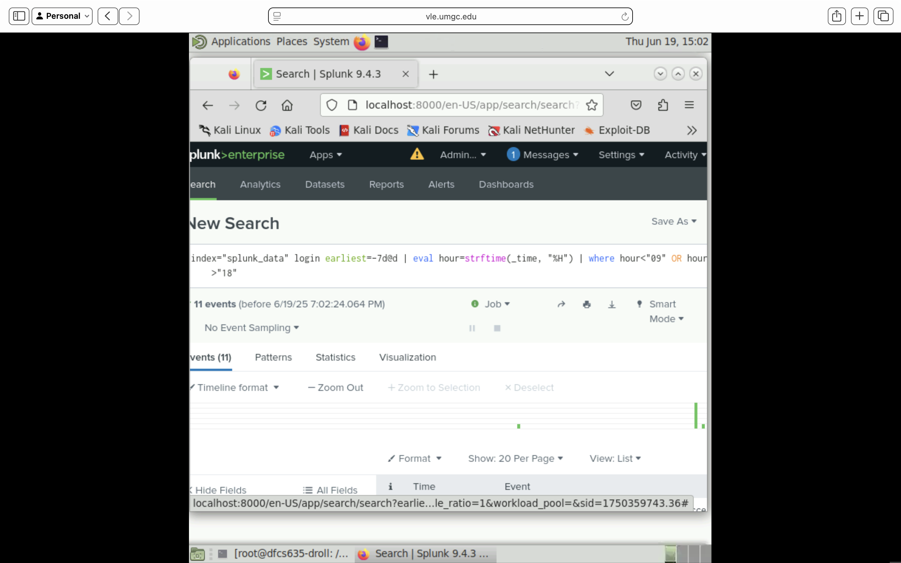

---

## Evidence 02 – Off-Hours Login Search Query

A second Splunk query was used to identify **login-related events occurring outside standard working hours**. The search filtered login events over the previous seven days and isolated results occurring **before 09:00 or after 18:00**.

This query was designed to surface potentially unusual access behavior that might not be obvious through a simple login search alone.

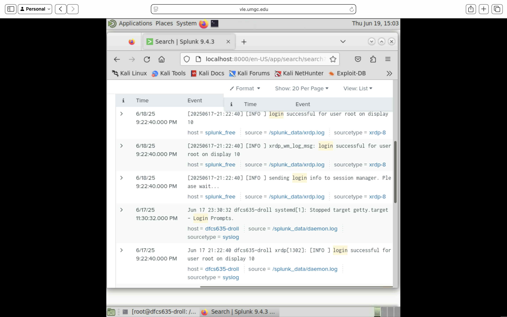

---

## Evidence 03 – Off-Hours Login Results

The results of the off-hours login query showed multiple login-related events returned by Splunk. These events demonstrated that login activity was present during non-standard working hours, including evening or late-night timeframes.

The results do not independently prove malicious activity, but they establish that access-related events occurred outside a normal daytime window and therefore warrant closer review.

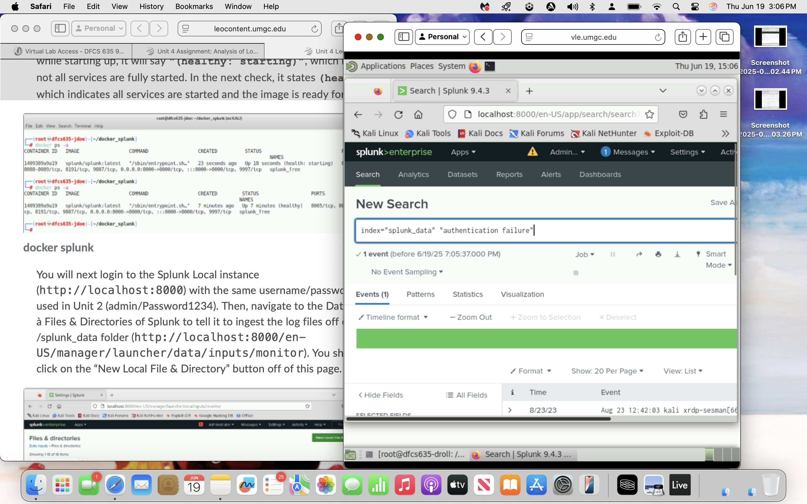

---

## Evidence 04 – Authentication Failure Results Overview

The search for **"authentication failure"** returned one matching event. This screenshot documents the overview of the search results and confirms that authentication-related errors were preserved in the indexed log data.

The result count and surrounding metadata help validate that the search returned a relevant security event rather than a false positive or empty query.

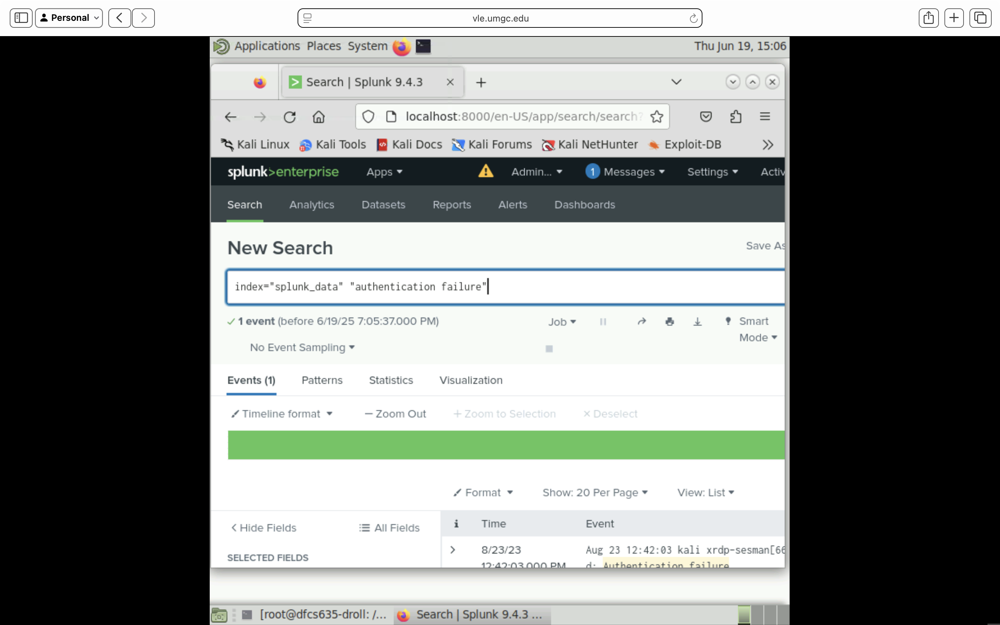

---

## Evidence 05 – Authentication Failure Event Detail

A detailed review of the authentication failure event revealed a **PAM authentication error** associated with a Linux log source. The event detail provides the strongest evidence in the project for a failed authentication attempt and captures the log context surrounding the error.

This artifact is important because it confirms that the authentication process generated a recognizable failure event in the log data.

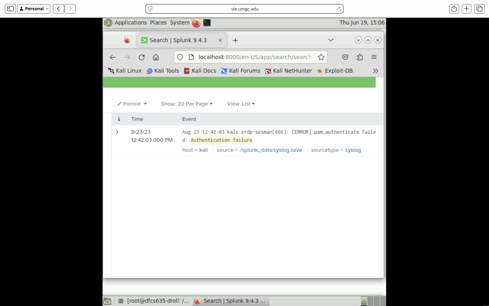

---

## Evidence 06 – `id_rsa` / Permission-Denied Search with No Results

A Splunk search was conducted for **"Permission denied"** combined with **"id_rsa"** to determine whether the indexed logs contained evidence of SSH private key access issues or permission-related errors.

The search returned **no results**, which is still an important evidentiary outcome because it helps narrow the scope of suspicious activity and documents what was not present in the dataset.

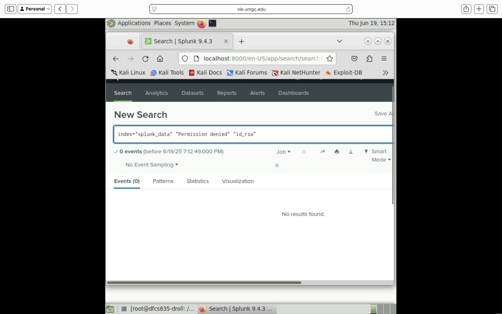

---

## Evidence 07 – `apt-get install` Results Overview

The investigation then shifted to software installation activity. A Splunk search for **`apt-get install`** returned multiple events associated with package installation and package-management history.

This screenshot captures the overview of those results and demonstrates that system modification activity was recorded in the indexed Linux logs.

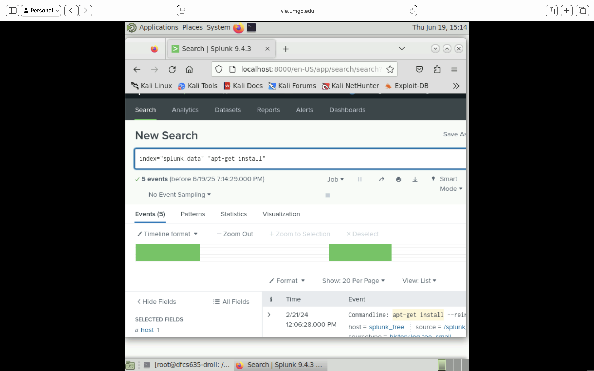

---

## Evidence 08 – `apt-get install` Event Details

A closer review of the package-management results revealed installation activity associated with packages such as **Maltego**, **waagent**, **gdebi-core**, and supporting development libraries or utilities.

This evidence is important because package installation history can reveal administrative actions, introduction of new tooling, or changes to the host that may be relevant in a broader forensic timeline.

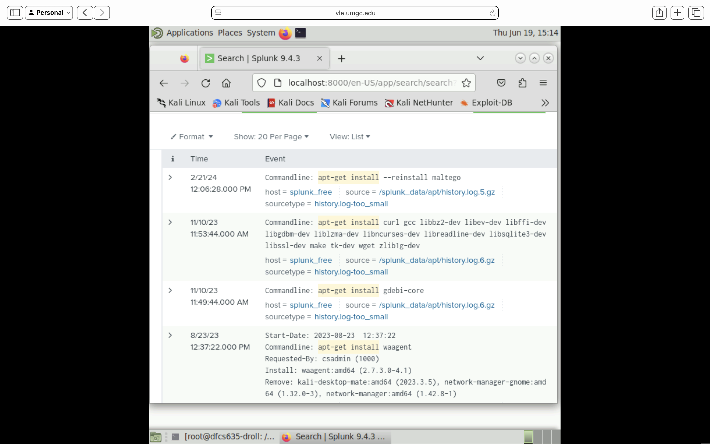

---

## Evidence 09 – `chroot` Search Results

A Splunk search for **`chroot`** returned a substantial number of matching events. This overview screenshot documents the search results and confirms that `chroot`-related activity was present in the indexed Linux logs.

Because `chroot` may be associated with sandboxing, service isolation, or other environment changes, these events were preserved for additional review.

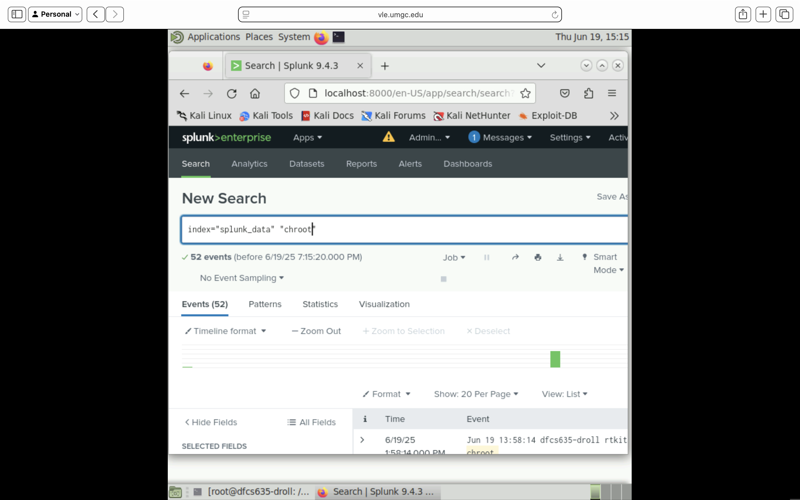

---

## Evidence 10 – `chroot` Event Details

Detailed review of the `chroot` results showed repeated events tied to an **`rtkit-daemon`** process that had **successfully called `chroot`**. The event detail view provides context for how the activity was logged and helps distinguish routine daemon behavior from potentially suspicious shell-driven activity.

This screenshot is important because it shows that the `chroot` results were not merely keyword hits, but real log events tied to a specific process and system activity.

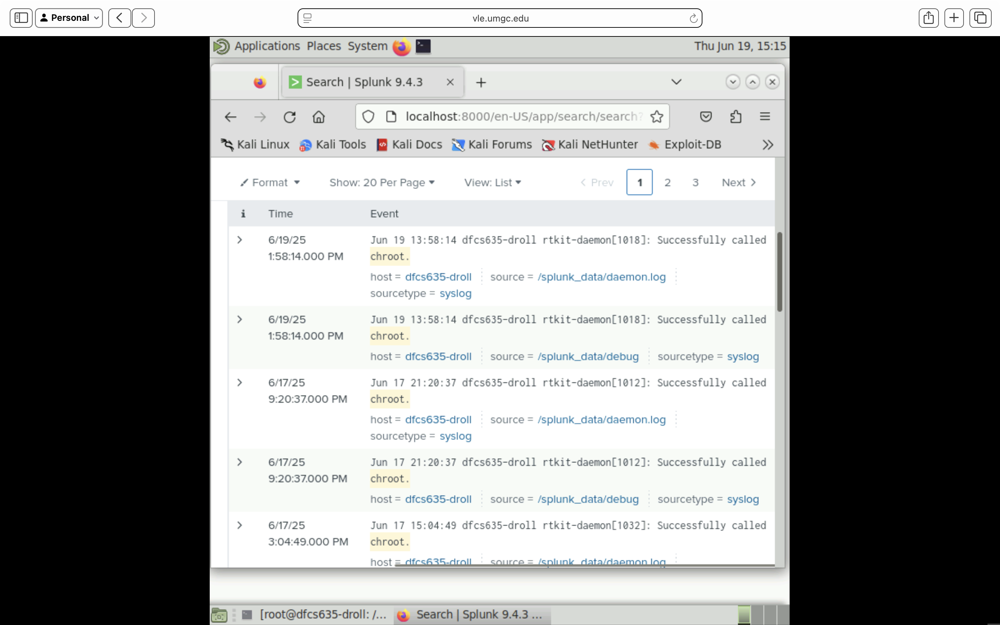

---

## Evidence 11 – John the Ripper Crack Results

The second half of the project focused on password recovery. Using **John the Ripper** and a student-oriented wordlist, two credentials were successfully cracked from a file containing **Raw-SHA256** password hashes.

This screenshot documents the cracking output showing that the tool recovered plaintext passwords from the supplied hash file.

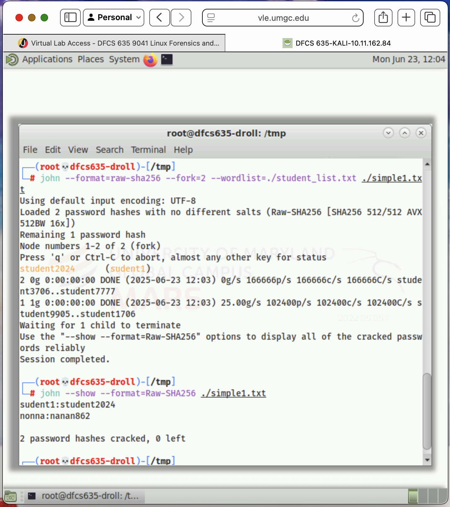

---

## Evidence 12 – Final Cracked Password Output

After cracking, the `john --show` command was used to display the recovered credentials and confirm the final results. The output showed that **two password hashes were cracked** and **zero remained unresolved**.

The final cracked credentials displayed were:

- `student1 : student2024`
- `nonna : nanan862`

This is one of the most significant pieces of evidence in the project because it confirms that the recovered hashes corresponded to weak passwords vulnerable to straightforward dictionary-based cracking.

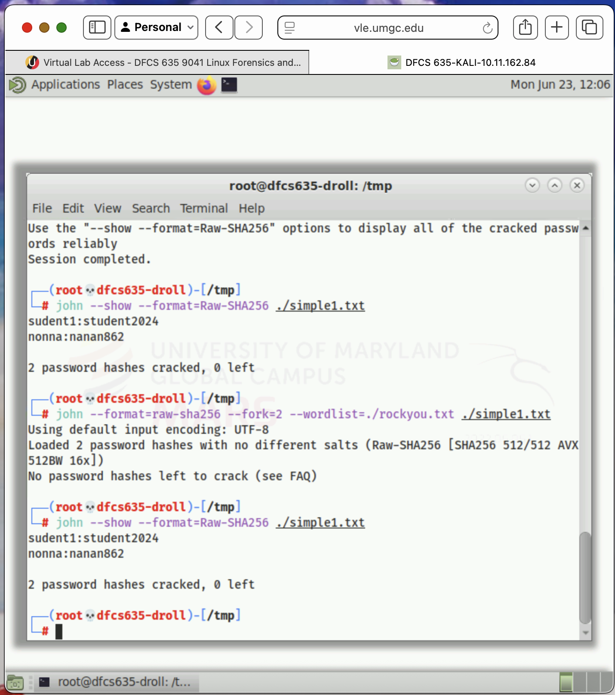

---

## Evidence Summary

The evidence collected during this investigation supports several important conclusions:

- The indexed Linux logs contained at least one **authentication failure**
- **Off-hours login activity** was present in the environment
- There was **no evidence of `id_rsa` / permission-denied events** in the scoped dataset
- **Software installation activity** was preserved in package-management logs
- **`chroot`-related events** were visible and attributable to a daemon process
- **Two password hashes were successfully cracked**, confirming weak credential practices

Together, these artifacts show how log analysis and password cracking can be combined to build a more complete forensic picture of system behavior, authentication anomalies, administrative activity, and credential risk.
